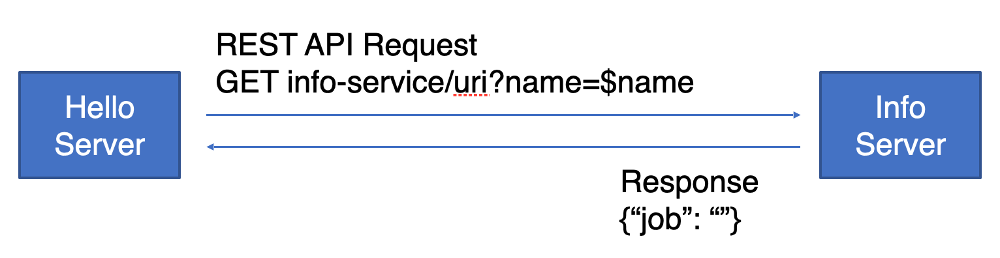

# Requirement

1. SayHello Server에서 InfoService Server로 내부 호출
    1. InfoService Server의 Port
        1. application.yml 에서 port 변경하여 설정
2. InfoService는 호출 파라미터로 찾은 데이터의 직업 응답

# Spec

WebClient

# Request

`GET localhost:8080/hello?name=$name`

# Response

`application/json`
- 직업 데이터가 추가 되었다.
```json
{
	"to": "$name",
	"job": "",
	"message": "hello $name"
}
```

# 내부 통신



